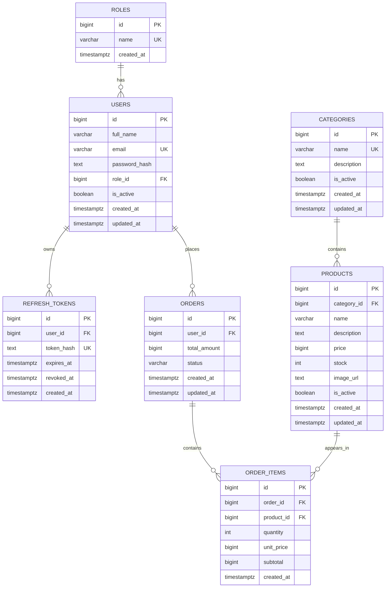

# ERD

```mermaid
erDiagram
    ROLES ||--o{ USERS : has
    USERS ||--o{ REFRESH_TOKENS : owns
    USERS ||--o{ ORDERS : places
    CATEGORIES ||--o{ PRODUCTS : contains
    ORDERS ||--o{ ORDER_ITEMS : contains
    PRODUCTS ||--o{ ORDER_ITEMS : appears_in

    ROLES {
        bigint id PK
        varchar name UK
        timestamptz created_at
    }

    USERS {
        bigint id PK
        varchar full_name
        varchar email UK
        text password_hash
        bigint role_id FK
        boolean is_active
        timestamptz created_at
        timestamptz updated_at
    }

    REFRESH_TOKENS {
        bigint id PK
        bigint user_id FK
        text token_hash UK
        timestamptz expires_at
        timestamptz revoked_at
        timestamptz created_at
    }

    CATEGORIES {
        bigint id PK
        varchar name UK
        text description
        boolean is_active
        timestamptz created_at
        timestamptz updated_at
    }

    PRODUCTS {
        bigint id PK
        bigint category_id FK
        varchar name
        text description
        bigint price
        int stock
        text image_url
        boolean is_active
        timestamptz created_at
        timestamptz updated_at
    }

    ORDERS {
        bigint id PK
        bigint user_id FK
        bigint total_amount
        varchar status
        timestamptz created_at
        timestamptz updated_at
    }

    ORDER_ITEMS {
        bigint id PK
        bigint order_id FK
        bigint product_id FK
        int quantity
        bigint unit_price
        bigint subtotal
        timestamptz created_at
    }
```
